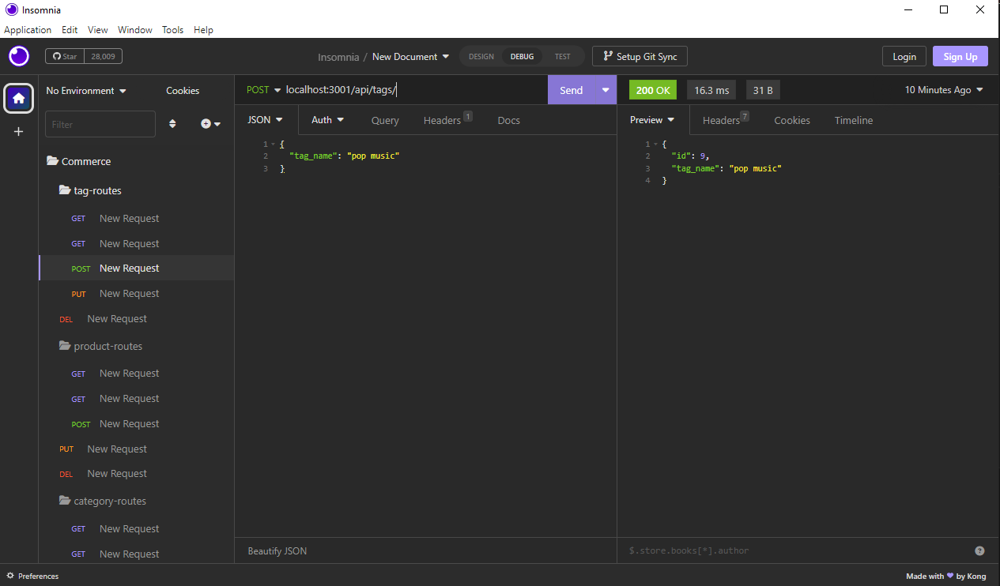

# Commerce Back End

## Description

This code is for routing api routes to models that you created with Sequelize syntax while uploading a seeds file filled with the data you need. Then being able to access the data through their apis and being able to get,post,put,and delete the data.

## Table of Contents

- [Installation](#installation)
- [Usage](#usage)
- [License](#license)
- [Features](#features)

## Installation

MySQL2, dotenv package, and Sequelize is installed into this project for functioning

## Usage

 
[Click here to see Deployed Application](https://watch.screencastify.com/v/Z5MSz4qsLIpkZROjkmNY)

## License

N/A

## Features

-Get request in the Database 
-Post request in the Database 
-Put request in the Database 
-Delete request in the Database

